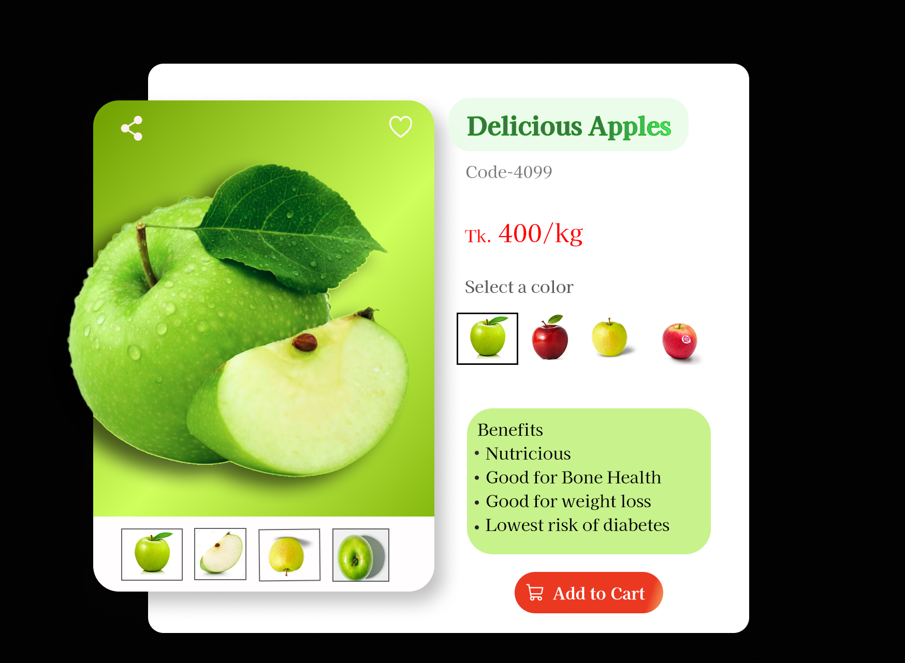

# 🛒 Interactive E-commerce Product Card UI (Figma)

A modern and visually appealing product card UI designed in Figma. This project demonstrates strong UI/UX principles, clean layout structure, and component-based design thinking for e-commerce interfaces.

---

## 🎨 Figma Design
View the full design here:  
👉 https://www.figma.com/design/XxrR65F3bVB8wInvokS8Bc/foodweb?node-id=0-1&t=yHk9IyOEcQ3PUU8B-1

---

## ✨ Features
- Clean and modern user interface  
- Well-structured layout with proper spacing and alignment  
- Product image preview with thumbnail variations  
- Interactive UI concept (variant selection & CTA button)  
- Clear visual hierarchy for product details and pricing  
- Component-based design using Figma  
- Built with Auto Layout for responsive adaptability  

---

## 🧠 Design Approach
This project focuses on creating a user-friendly and visually balanced product card by applying:

- UI/UX best practices  
- Consistent color palette and typography  
- Logical information hierarchy  
- Scalable and reusable components  

---

## 🛠️ Tools Used
- Figma (UI Design & Prototyping)

---

## 📸 Preview

---

